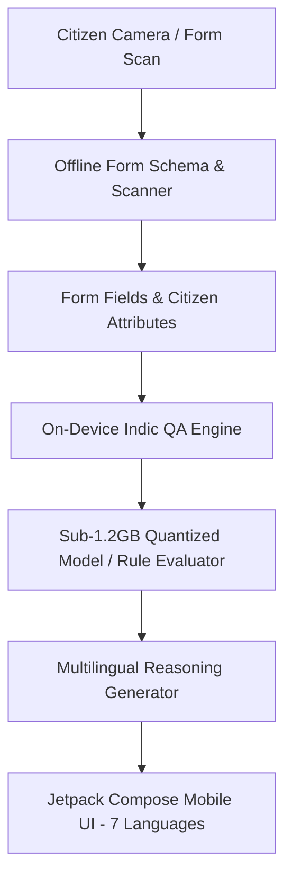

# Project Handbook — GovFormAI-Offline-IndicQA

**PS-I2: "Intelligence Without the Data Centre"** — An offline, on-device AI system for government form understanding and multi-clause eligibility rule reasoning running entirely on **sub-Rs.12,000 class Android hardware (3 GB RAM)** across 7 languages with zero network dependency.

---

## 1. System Architecture & Capabilities



### Key Highlights
- **Zero Network Calls**: Runs 100% offline in Airplane Mode.
- **Sub-1.2 GB Memory Profile**: Resident Set Size (RSS) stays under 1,200 MB to avoid Android Low Memory Killer (LMK) termination on 3 GB RAM devices.
- **Multi-Clause Rule Eligibility Reasoning**: Answers complex eligibility questions (e.g. *"Am I eligible for Old Age Pension given my age of 62 and annual income of ₹40,000 with a BPL card?"*) by evaluating rules on-device and providing step-by-step reasoning chains.
- **7 Supported Languages**: `en`, `hi`, `bn`, `te`, `ta`, `mr`, `kn`.

---

## 2. Directory Structure & Handoff Roles

| Directory | Lead / Role | Purpose & Contents |
| :--- | :--- | :--- |
| [`/model`](file:///C:/GovFormAI-Offline-IndicQA/model) | **Developer A** | GGUF conversion (`convert_to_gguf.py`), memory footprint verification, quantized specs (`model_q4_k_m_tok1_v1.gguf.spec.json`). |
| [`/eval`](file:///C:/GovFormAI-Offline-IndicQA/eval) | **Developer B** | IndicQA scoring harness (`eval_indicqa.py`), Exact Match, token F1, and Rule Reasoning Accuracy metrics across 7 languages. |
| [`/bench`](file:///C:/GovFormAI-Offline-IndicQA/bench) | **Developer B** | On-device profiling scripts (`on_device_profile.py`) measuring RSS memory footprint (<1.2GB), TTFT, and tokens/sec. |
| [`/app`](file:///C:/GovFormAI-Offline-IndicQA/app) | **Developer C** | Android Jetpack Compose app (`MainActivity.kt`, `GovFormApp.kt`, `FormEngine.kt`) supporting 7 languages and offline rule evaluation. |
| [`/docs`](file:///C:/GovFormAI-Offline-IndicQA/docs) | **All** | Operational limits ([`docs/LIMITS.md`](file:///C:/GovFormAI-Offline-IndicQA/docs/LIMITS.md)) and architecture documentation. |
| [`/datasets/ps_i2_ondevice`](file:///C:/GovFormAI-Offline-IndicQA/datasets/ps_i2_ondevice) | **All** | 120 forms schema index (`forms_120_index.json`), QA pairs (`qa_flat.csv`), sub-Rs.12k hardware profile (`sub_12k_3gb_ram.json`). |

---

## 3. Running Model Conversion, Evaluation & Benchmarking

### Step 1: Validate Model Quantization & Memory Ceiling
```bash
python model/convert_to_gguf.py \
    --checkpoint ./checkpoints/indic-slm \
    --out-dir ./model/quant \
    --quant-type q4_k_m \
    --max-rss-mb 1200
```

### Step 2: Run Evaluation Harness Across 7 Languages
```bash
python eval/harness/eval_indicqa.py \
    --model-path model/quant/model_q4_k_m_tok1_v1.gguf.spec.json \
    --dataset datasets/ps_i2_ondevice/qa_flat.csv \
    --out-file eval/results/eval_report.json
```

### Step 3: Run On-Device Memory & Throughput Benchmark
```bash
python bench/scripts/on_device_profile.py \
    --model-path model/quant/model_q4_k_m_tok1_v1.gguf.spec.json \
    --device-profile sub_12k_3gb_ram \
    --out-file bench/results/sub_12k_profile_report.json
```
